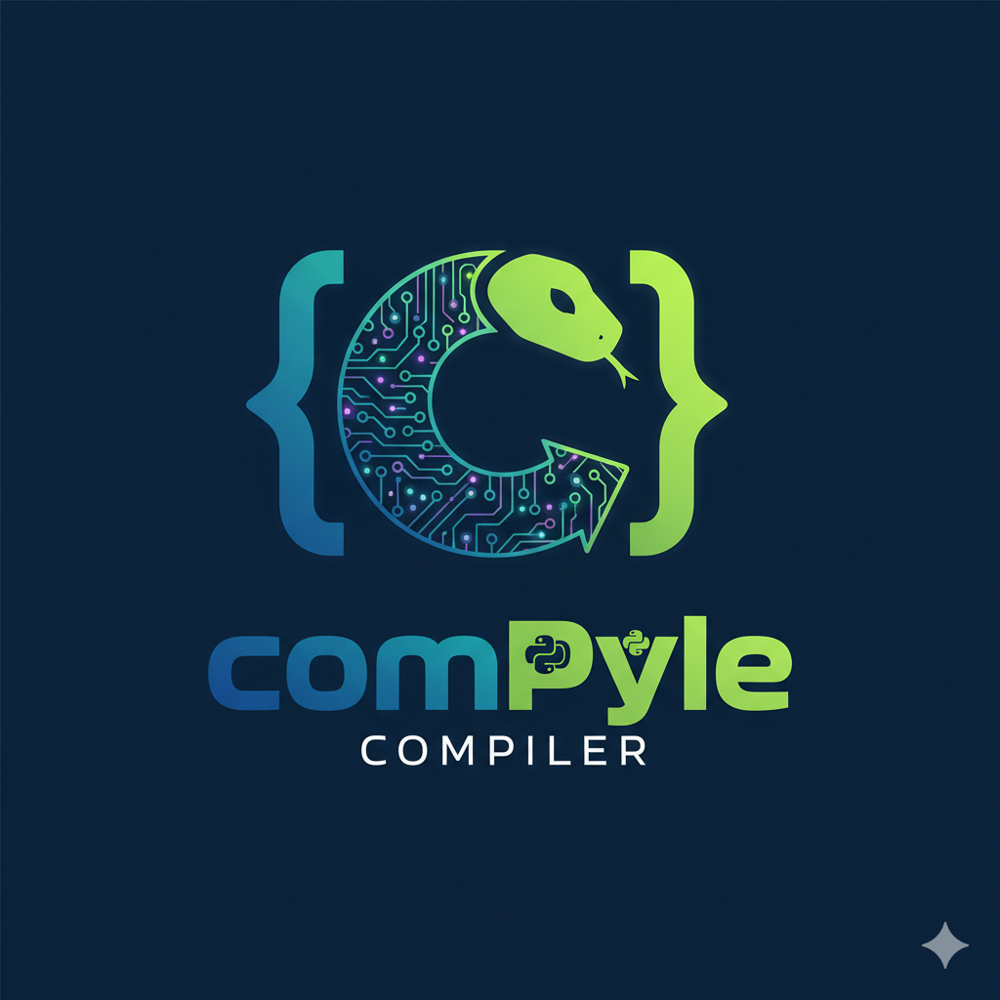

# 🧩 ComPyle – Compilador Matemático em Python



O **ComPyle** é um compilador experimental desenvolvido em **Python** com o objetivo de **demonstrar, de forma didática e visual, o processo de compilação de expressões matemáticas**.  
O projeto tem caráter **educacional** e busca apresentar, de modo estruturado, as principais etapas de um compilador tradicional — desde a análise léxica até a execução do código.

---

## 🎯 Objetivo Geral

Desenvolver um ambiente de compilação interativo capaz de **ler arquivos em Python contendo expressões matemáticas**, realizar a **análise completa do código**, **gerar a representação intermediária**, e **executar as instruções**, evidenciando cada uma das fases envolvidas no processo.

---

## ⚙️ Funcionalidades Principais

- **Leitura automática de arquivos `.py`**
- **Análise Léxica:** identificação e categorização dos tokens presentes no código  
- **Análise Sintática:** construção da árvore de derivação da expressão  
- **Análise Semântica:** validação de funções matemáticas reconhecidas  
- **Geração de Código Intermediário (IR):** representação em formato simplificado  
- **Otimização:** eliminação de instruções redundantes  
- **Execução:** avaliação final da expressão  
- **Interface Gráfica (Tkinter):** interação visual com o processo de compilação

---

## 🧮 Funções Matemáticas Suportadas

O compilador reconhece as seguintes funções do módulo `math` da linguagem Python:

```
sqrt, pow, exp, log, log10, sin, cos, tan,
floor, ceil, modf, remainder, isqrt, fmod, trunc,
degrees, radians, cbrt
```

Essas funções contemplam operações fundamentais de **álgebra, trigonometria e análise numérica**, permitindo que o ComPyle seja utilizado em contextos de **ensino de compiladores e matemática computacional**.

---

## 🖥️ Interface e Usabilidade

A interface gráfica foi desenvolvida em **Tkinter**, utilizando um **layout temático escuro** com contrastes suaves para melhor legibilidade.  
O usuário pode selecionar um **arquivo `.py`** contendo expressões matemáticas e acompanhar, de forma interativa, as seguintes etapas:

1. Extração automática das funções do módulo `math`  
2. Apresentação das fases de compilação  
3. Exibição da saída otimizada e do resultado final  


---

## 🗂️ Estrutura do Projeto

```plaintext
Compyle/
 ├── lexer.py              # Analisador Léxico
 ├── parser_.py            # Analisador Sintático
 ├── semantic.py           # Verificador Semântico
 ├── ir_generator.py       # Gerador de Código Intermediário
 ├── optimizer.py          # Otimizador de Instruções
 ├── executor.py           # Executor das Operações
 ├── main.py               # Interface Gráfica e Controle Principal
 ├── logo.png              # Logotipo do Projeto
 ├── test.py               # Arquivo de Testes
 └── README.md             # Documento Descritivo
```

---

## 🚀 Execução do Projeto

### 🐍 Requisitos

- **Python 3.9** ou superior  
- Biblioteca **Pillow** para exibição de imagens  

Instalação dos requisitos:
```bash
pip install pillow
```

### ▶️ Execução

No diretório principal do projeto:
```bash
python main.py
```

Etapas de uso:

1. Selecionar o arquivo `.py` contendo expressões matemáticas  
2. Executar o processo de compilação  
3. Visualizar, na área de saída, as fases e o resultado final

---

## 🧾 Exemplo de Arquivo `test.py`

```python
import math

a = math.sqrt(9)
b = math.pow(2, 5) + math.log10(100)
print(math.sin(1.57) + math.cos(0))
resultado = math.cbrt(27) + math.trunc(3.9)
```

---

## 🧠 Etapas do Processo de Compilação

| Etapa | Descrição |
|-------|------------|
| **Análise Léxica** | Identifica tokens, números, operadores e símbolos. |
| **Análise Sintática** | Estrutura a expressão em uma árvore hierárquica. |
| **Análise Semântica** | Verifica a validade de funções e variáveis. |
| **Código Intermediário** | Traduz a árvore em instruções de execução. |
| **Otimização** | Remove redundâncias e simplifica o código. |
| **Execução** | Calcula e exibe o resultado da expressão. |

---

## 🧩 Relevância Acadêmica

O **ComPyle** foi concebido como um projeto de apoio ao ensino de **Linguagens Formais, Compiladores e Processamento de Linguagens**, permitindo que estudantes visualizem, em tempo real, como ocorre a transformação de uma expressão matemática em código executável.  
Além de seu valor didático, o projeto também exemplifica o uso de **programação estruturada, orientação a objetos e bibliotecas gráficas** em Python.

---

## 👨‍💻 Autor

**Lucas Rodrigues Dias Nascimento**  
Graduando em **Ciência da Computação**  
Desenvolvedor com foco em **automação, linguagens de programação e sistemas educacionais**.  

🔗 GitHub: [@lucasrodriguesdias](https://github.com/lucasrodriguesdias)  
✉️ Contato: lucasrd1407@gmail.com

---

## 🪪 Licença

Este projeto é distribuído sob licença livre, com finalidade exclusivamente **educacional e acadêmica**.  
O uso e a modificação são permitidos, desde que seja mantida a **referência ao autor original**.


Se este projeto contribuiu com seus estudos ou pesquisas, considere deixar uma **estrela no repositório**.  
Seu apoio incentiva a continuidade do desenvolvimento de ferramentas educacionais abertas. 🌟
